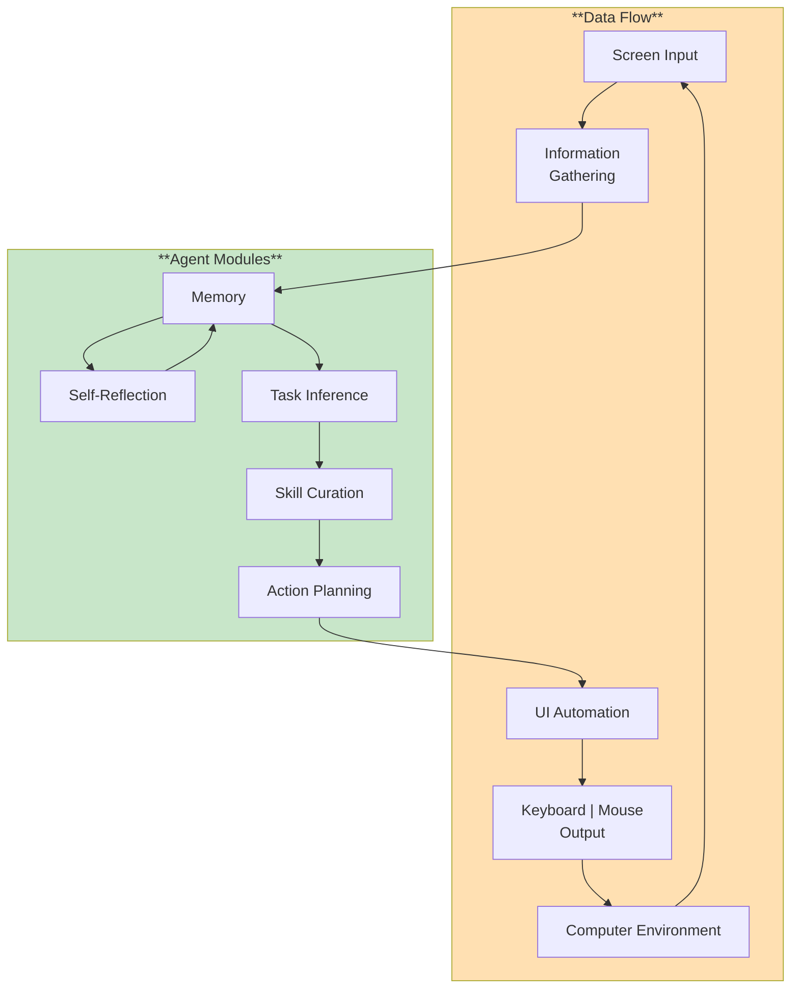
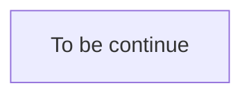

# AI Gaming Agent 🎮

The project aims to apply a comprehensive AI gaming agent framework built on top of **smolagents** to create intelligent agents capable of playing and mastering various types of games, from simple board games to complex universal gaming environments.

## Technology Stack

- [SmolAgents](https://github.com/huggingface/smolagents): A lightweight framework for building AI agents.
- [Cradle](https://github.com/BAAI-Agents/Cradle): A framework which attempts at General Computer Control (GCC).

## Environment Installation

It is suggested to use a remote virtual environment for environment configurations to prevent from directly executing the Python code generated by the AI agent locally. For details please take reference to [SmolAgent Documentation](https://huggingface.co/docs/smolagents/index).

1. Please install a virtual environment.

   ```
   python3 -m venv .venv # Name it as .venv
   source .venv/bin/activate # Activate .venv
   ```

2. Install necessary libraries.
   ```
   pip install smolagent
   “smolagent[toolkit]” # For basic tasks
   “smolagents[openai]” # For OpenAI API
   "smolagents[vision]" # For computer vision tasks
   "smolagents[docker]" # To execute code in a sandbox environment for security
   "smolagents[telemetry]" # Add support for monitoring and tracing
   ```

## Requirements
```
smolagents>=1.0.0
openai>=1.40.0
pyautogui>=0.9.54
pillow>=10.0.0
pyscreeze>=0.1.30
mss>=9.0.1
pygetwindow>=0.0.9
mouseinfo>=0.1.3
python-dotenv>=1.0.1
helium>=3.0.0
```

## AgentArchitecture

The architecture is reference from [Cradle](https://github.com/BAAI-Agents/Cradle).



## Code Structure



## License

This project is licensed under the MIT License - see the [LICENSE](LICENSE) file for details.

## Acknowledgments

- **Hugging Face** for the amazing smolagents framework
