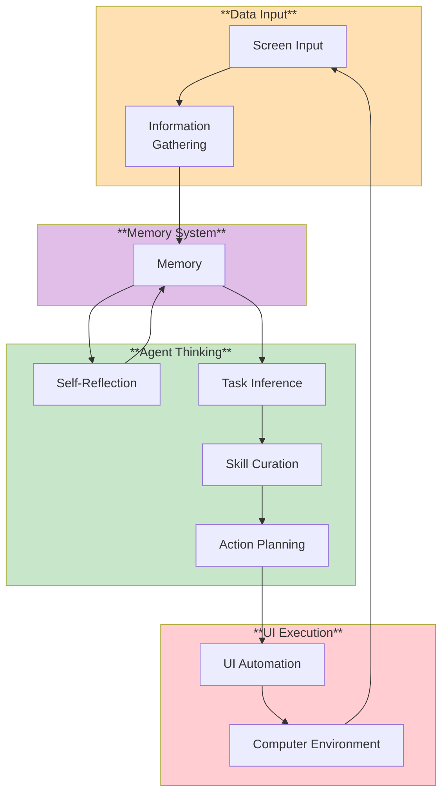

# AI Gaming Agent 🤖 + 🎮

The project aims to apply a comprehensive AI gaming agent framework built on top of **smolagents** to create intelligent agents capable of playing and mastering various types of games, from simple board games to complex universal gaming environments.

## Technology Stack

- [SmolAgents](https://github.com/huggingface/smolagents): A lightweight framework for building AI agents.
- [Cradle](https://github.com/BAAI-Agents/Cradle): A framework which attempts at General Computer Control (GCC).

## Environment Installation

It is suggested to use a remote virtual environment for environment configurations to prevent from directly executing the Python code generated by the AI agent locally. For details please take reference to [SmolAgent Documentation](https://huggingface.co/docs/smolagents/index).

1. Please install a virtual environment.

   ```
   python3 -m venv .venv # Name it as .venv
   source .venv/bin/activate # Activate .venv
   ```

2. Install necessary libraries.

   ```
   pip install -r requirements.txt
   ```

3. Create a `.env` file for storing api key

   ```
   echo 'OPENAI_API_KEY=your-api-key' > .env
   ```

   Or export as environment variable:

   ```
   export OPENAI_API_KEY='your-api-key'
   ```

4. Running Tests
   Without LLM (basic module tests):

   ```
   python -m src.modules.test.test_without_llm
   ```

   With LLM (requires API key):

   ```
   python -m src.modules.test.test_modules
   ```

5. Usage

   ```
   python -m src.modules.main
   ```

   Or with a custom task:

   ```
   python -m src.modules.main "Open Chrome and search for OpenAI"
   ```

6. View logs

   All terminal output is automatically saved to timestamped log files:

   ```
   src/modules/memory/task_log/task_YYYYMMDD_HHMMSS.log
   ```

   Logs include full prompts, responses, and token usage for all LLM calls.

7. Reset memory
   ```
   rm src/modules/memory/data/*.json
   rm src/modules/memory/data/*.npy
   rm src/modules/screen_input/screenshots/*.jpg
   rm src/modules/memory/task_log/*.log  # Optional: clear logs
   ```

## Agent Architecture

The architecture is reference from [Cradle](https://github.com/BAAI-Agents/Cradle). Please read [ARCHITECTURE.md](ARCHITECTURE.md) for details.



## Code Structure


## License

This project is licensed under the MIT License - see the [LICENSE](LICENSE) file for details.

## Acknowledgments

- **Hugging Face** for the amazing smolagents framework

## Log

### 15/10/2025

- Focus on image contextual memory (image to text description)
- Memory store screenshots (older screenshots more blur, and store limited number of screenshots, buffer zone)
- Screenshots frequency
- Memory limit, delete old memory?
- Test if the saved succesfull memory skills can be reused
- Compare strong model without vision support and weak model with vison support (ocr, yolo...)
- Store reflection into JSON everytime?
- Screenshot specific window?

### 22/10/2025

- Added comprehensive LLM logging: all prompts, responses, and token usage are now logged
- Added automatic log file saving to `src/modules/memory/task_log/` with timestamps
- All terminal output is captured and saved for debugging and analysis
- Added TaskLogger class with TeeOutput for simultaneous console and file logging

### 8/10/2025

- Add EasyOCR for character detection
- Add YOLOv8Small for object detection
- Adjust the screen capture to native resolution capture instead of logical resolution capture

### 5/10/2025

- Added action_planning module
- Added self_reflection module
- Added skill_curation module
- Added task_inference module
- Added test module
- Performance not optimal, should optimize it
  - llm cannot compare contextual semantic screenshots, that is, it can not directly notice the change in screenshots
  - llm can struggles on one page for a long time
  - does the atomic actions work on multiple operating systems (MacOS, Windows, Linux)?

### 2/10/2025

- Added ui_automation module
- Added screen_input module
- Added information_gathering module
- Added memory module

### 27/9/2025

- Created modules folder
- Designed developing process

### 23/9/2025

- Added demo and reference from ByteDance Tars

### 18/9/2025

- Initialized project
