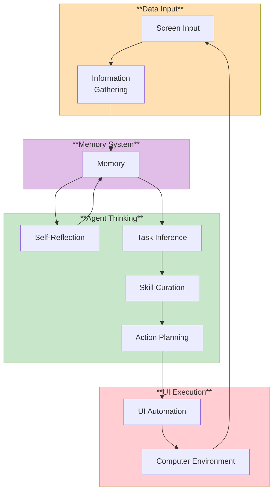
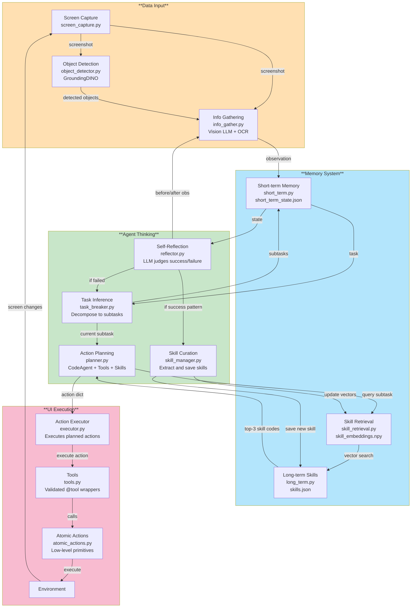

# AI Gaming Agent

A general-purpose GUI automation agent capable of playing games and automating desktop tasks. Uses vision LLMs to understand screen content and execute actions.

## Technology Stack

- [Cradle](https://github.com/BAAI-Agents/Cradle): Architecture reference for General Computer Control (GCC)
- [Game-TARS](https://github.com/BAAI-Agents/Game-TARS): Memory and sparse thinking optimizations
- Supports OpenAI, Qwen (DashScope), and other OpenAI-compatible APIs

## Environment Installation

It is suggested to use a remote virtual environment for environment configurations to prevent from directly executing the Python code generated by the AI agent locally. For details please take reference to [SmolAgent Documentation](https://huggingface.co/docs/smolagents/index).

1. Please install a virtual environment.

   ```
   python3 -m venv .venv # Name it as .venv
   source .venv/bin/activate # Activate .venv
   ```

2. Install necessary libraries.

   ```
   pip install -r requirements.txt
   ```

3. **Install GroundingDINO** for precise visual detection:

   **Quick Setup (Recommended):**

   Linux/macOS:

   ```bash
   ./setup_groundingdino.sh
   ```

   Windows:

   ```cmd
   setup_groundingdino.bat
   ```

   **Manual Setup:**

   ```bash
   # Install GroundingDINO
   pip install groundingdino-py

   # Download model files to ./cache/
   mkdir -p cache
   cd cache
   wget https://raw.githubusercontent.com/IDEA-Research/GroundingDINO/main/groundingdino/config/GroundingDINO_SwinB.cfg.py -O GroundingDINO_SwinB_cfg.py
   wget https://github.com/IDEA-Research/GroundingDINO/releases/download/v0.1.0-alpha2/groundingdino_swinb_cogcoor.pth
   cd ..
   ```

   **Note**: The agent works without GroundingDINO (vision-only mode), but GroundingDINO provides much better accuracy for clicking visual elements like icons, buttons, and game objects.

4. Create a `.env` file for storing api key

   ```
   echo 'OPENAI_API_KEY=your-api-key' > .env
   ```

   Or export as environment variable:

   ```
   export OPENAI_API_KEY='your-api-key'
   ```

5. Usage

   **Quick Start (Recommended):**

   Linux/macOS:

   ```bash
   ./run_agent.sh
   ```

   Windows:

   ```cmd
   run_agent.bat
   ```

   Interactive launcher with two modes:

   - **Fullscreen**: Capture entire monitor (choose monitor 0/1/2/...)
   - **Specific Window**: Capture only target window (higher resolution, better accuracy)

   **Game-TARS Features (Enabled by Default):**

   The agent now includes 6 major improvements:

   - **Two-tier memory**: 2480 steps (was 20) - handles long games
   - **Sparse thinking**: 3-4x faster by skipping reasoning on simple actions
   - **Task clarification**: Asks questions about ambiguous tasks
   - **Completion detection**: Validates before finishing
   - **Stuck detection**: Auto-recovery when stuck
   - **Reactive planning**: Fast action-only mode (2-5s vs 45s)

   Performance: **~12s per action** (was 45-60s), **124x more memory**

   **Manual Usage:**

   Fullscreen on primary monitor:

   Linux/macOS:

   ```bash
   MONITOR_INDEX=1 python -m src.modules.main "Your task here"
   ```

   Windows (PowerShell):

   ```powershell
   $env:MONITOR_INDEX=1; python -m src.modules.main "Your task here"
   ```

   Windows (CMD):

   ```cmd
   set MONITOR_INDEX=1 && python -m src.modules.main "Your task here"
   ```

   Specific window:

   Linux/macOS:

   ```bash
   WINDOW_TITLE="Microsoft Edge" python -m src.modules.main "Your task here"
   ```

   Windows (PowerShell):

   ```powershell
   $env:WINDOW_TITLE="Microsoft Edge"; python -m src.modules.main "Your task here"
   ```

   Windows (CMD):

   ```cmd
   set WINDOW_TITLE=Microsoft Edge && python -m src.modules.main "Your task here"
   ```

   **Windows Requirements:**

   - Window capture requires `pywin32`: `pip install pywin32`
   - Falls back to fullscreen if not installed

   Notes:

   - Press `b` during prompts to go back (interactive mode)
   - `MONITOR_INDEX`: 0=all, 1=primary, 2=secondary, etc.
   - Window mode automatically detects which monitor contains the window

6. View logs and tokens

   All terminal output is automatically saved to timestamped log files. Logs include full prompts, responses, and token usage for all LLM calls.

   ```
   src/modules/memory/task_log/task_YYYYMMDD_HHMMSS.log
   ```

   Check for tokens used. Remember to change the log name in line 143 in code.

   ```
   python src/modules/memory/task_log/analyze_tokens.py
   ```

7. Reset memory

   Linux/macOS:

   ```bash
   rm src/modules/memory/data/*.json
   rm src/modules/memory/data/*.npy
   rm src/modules/screen_input/screenshots/*.jpg
   rm src/modules/memory/task_log/*.log
   ```

   Windows (PowerShell):

   ```powershell
   Remove-Item src/modules/memory/data/*.json
   Remove-Item src/modules/memory/data/*.npy
   Remove-Item src/modules/screen_input/screenshots/*.jpg
   Remove-Item src/modules/memory/task_log/*.log
   ```

   Windows (CMD):

   ```cmd
   del src\modules\memory\data\*.json
   del src\modules\memory\data\*.npy
   del src\modules\screen_input\screenshots\*.jpg
   del src\modules\memory\task_log\*.log
   ```

## Documentation

- **[ARCHITECTURE.md](ARCHITECTURE.md)**: Agent architecture (Cradle-inspired)

## Agent Architecture

Reference: [Cradle](https://github.com/BAAI-Agents/Cradle). See [ARCHITECTURE.md](ARCHITECTURE.md) for details.

**Game-TARS Features Implemented:**

- Two-tier memory system (124x longer context)
- Sparse thinking (3.8x faster gameplay)
- Task clarification (1.6x better accuracy)
- Complete implementation checklist



## Code Structure



## License

This project is licensed under the MIT License - see the [LICENSE](LICENSE) file for details.

## Acknowledgments

- **Hugging Face** for the amazing smolagents framework
